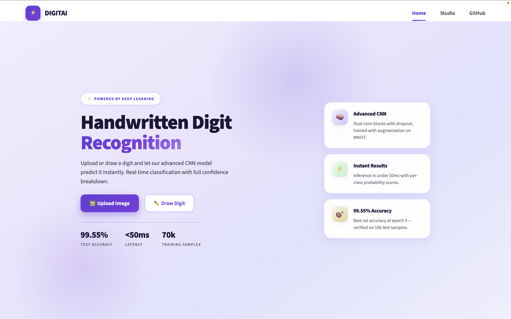
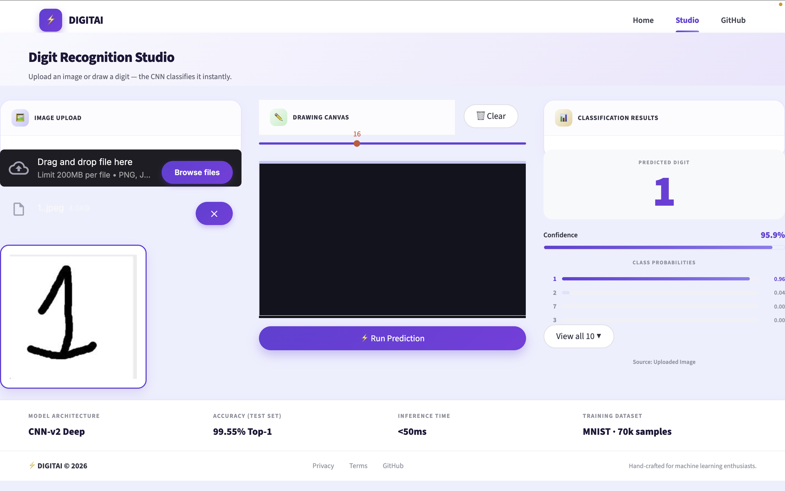
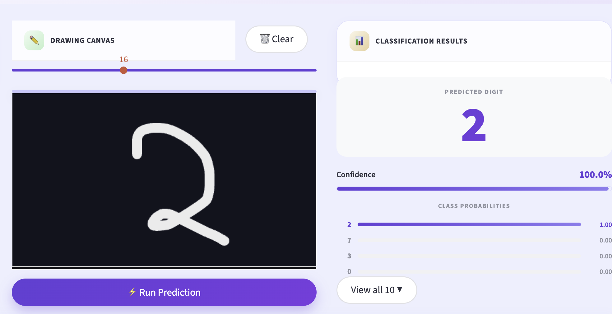
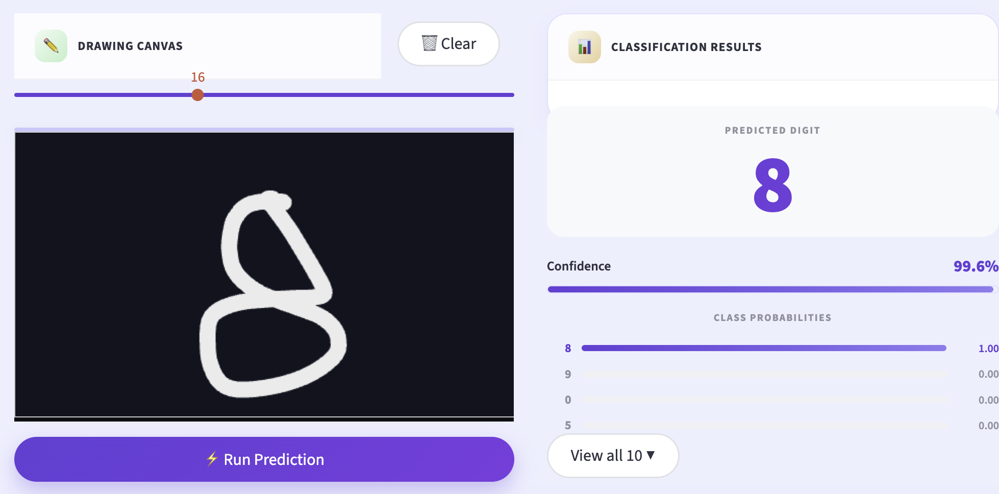
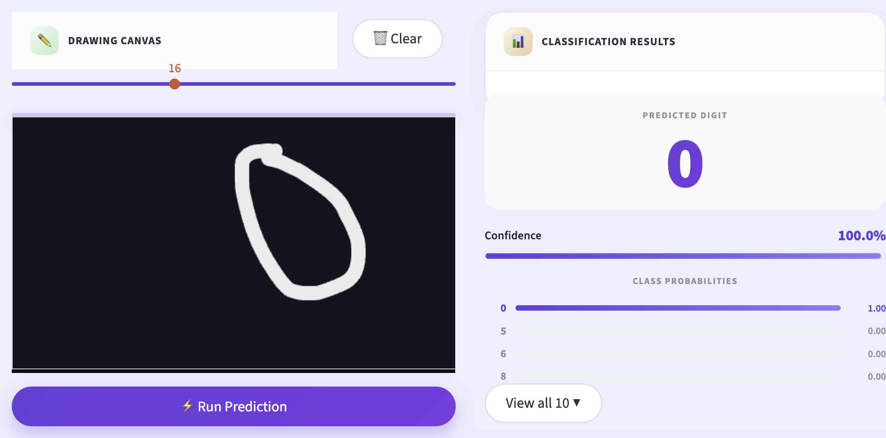

<div align="center">


<br/>

[](https://python.org)
[](https://streamlit.io)
[](https://tensorflow.org)
[](https://keras.io)
[](https://opencv.org)

<br/>


<br/>

> **A full-stack deep learning web app that classifies handwritten digits in real time.**
> Draw a digit or upload an image — CNN predicts it instantly with full confidence breakdown.

<br/>

**[📸 Screenshots](#-screenshots)** &nbsp;•&nbsp; **[✨ Features](#-features)** &nbsp;•&nbsp; **[⚙️ How It Works](#️-how-it-works)** &nbsp;•&nbsp; **[🧠 Model](#-model-architecture)** &nbsp;•&nbsp; **[🚀 Getting Started](#-getting-started)** &nbsp;•&nbsp; **[📁 Structure](#-project-structure)** &nbsp;•&nbsp; **[🛠️ Tech Stack](#️-tech-stack)** &nbsp;•&nbsp; **[🔬 Training](#-training-optional)**

<br/>

</div>

---

## 📸 Screenshots

<div align="center">

### 🖥️ App Pages

| 🏠 Home Page | 📤 Upload Mode |
|:---:|:---:|
|  |  |

<br/>

### ⚡ Predictions in Action

| ✏️ Predict 2 | ✏️ Predict 8 | ✏️ Predict 0 |
|:---:|:---:|:---:|
|  |  |  |

</div>

---

## ✨ Features

| Feature | Description |
|:---|:---|
| ⚡ **Real-time Inference** | Predict digits in under 50ms |
| ✏️ **Drawing Canvas** | Freehand drawing with adjustable brush size |
| 📤 **Image Upload** | Supports PNG, JPG, BMP formats |
| 📊 **Confidence Breakdown** | Full per-class probability scores for digits 0–9 |
| 🎨 **Beautiful 2-Page UI** | Home landing page + Studio workspace |
| 🧠 **Advanced CNN** | 99.55% test accuracy on MNIST test set |

---

## ⚙️ How It Works

<div align="center">

### From your hand to a prediction — in under 50ms ⚡

</div>

<br/>

**🖊️ Step 1 — Input**

> You either **draw** a digit on the freehand canvas or **upload** an image file (PNG, JPG, BMP). Both paths feed into the same preprocessing pipeline.

<br/>

**🔧 Step 2 — Preprocessing**

> Raw input is messy — different sizes, positions, stroke widths. The pipeline cleans it all:
>
> | # | Operation | Purpose |
> |:---:|:---|:---|
> | 1️⃣ | Grayscale conversion | Strip color, keep structure |
> | 2️⃣ | Otsu thresholding | Clean binary black & white image |
> | 3️⃣ | Bounding box crop | Remove empty space around digit |
> | 4️⃣ | Padding | Center the digit with breathing room |
> | 5️⃣ | Resize to 28 × 28 | Match exact MNIST training format |
> | 6️⃣ | Normalize 0–255 → 0.0–1.0 | Scale pixels for the neural network |

<br/>

**🧠 Step 3 — CNN Inference**

> The clean 28×28 image passes through the trained CNN — two convolutional blocks extract visual features, then dense layers classify the digit. The model outputs 10 probability scores, one per class.

<br/>

**📊 Step 4 — Results**

> The app displays the predicted digit, confidence percentage, and a full probability bar chart for all 10 digit classes — so you see exactly how certain the model is.

<br/>

<div align="center">

```
  🖊️  Draw on canvas                    📤  Upload an image
              ↘                                ↙
               🔧  Grayscale → Threshold → Crop → Pad → 28×28 → Normalize
                                        ↓
               🧠  Conv Block 1 → Conv Block 2 → Dense(256) → Softmax(10)
                                        ↓
               📊  Predicted Digit  ·  Confidence %  ·  Class Probabilities
```

</div>

> 💡 **Why preprocessing matters** — The CNN was trained on clean, centered 28×28 MNIST digits. A digit drawn in the corner or at the wrong scale would confuse the model. The pipeline bridges that gap between real-world input and training data format — which is the key to 99.55% real-world accuracy.

---

## 🧠 Model Architecture

```
Input (28 × 28 × 1)
        │
        ▼
┌─────────────────────────────────┐
│  Conv2D(32, 3×3)  ReLU          │
│  Conv2D(32, 3×3)  ReLU          │  ←  detects edges & basic strokes
│  MaxPooling2D                   │
│  Dropout(0.25)                  │
└─────────────────────────────────┘
        │
        ▼
┌─────────────────────────────────┐
│  Conv2D(64, 3×3)  ReLU          │
│  Conv2D(64, 3×3)  ReLU          │  ←  learns curves & digit shapes
│  MaxPooling2D                   │
│  Dropout(0.25)                  │
└─────────────────────────────────┘
        │
        ▼
┌─────────────────────────────────┐
│  Flatten                        │
│  Dense(256)  ReLU               │  ←  combines all learned features
│  Dropout(0.5)                   │
│  Dense(10)   Softmax            │  ←  final class probabilities
└─────────────────────────────────┘
        │
        ▼
   Prediction  (0 – 9)
```

| Hyperparameter | Value |
|:---|:---|
| Optimizer | Adam (lr = 1e-3) |
| Loss | Sparse Categorical Crossentropy |
| Augmentation | Rotation ±10°, Zoom ±10%, Shifts ±10% |
| Batch Size | 128 |
| Callbacks | ReduceLROnPlateau + EarlyStopping |
| **Test Accuracy** | **99.55%** ✅ |

---

## 🚀 Getting Started

### 1️⃣ Clone the repository
```bash
git clone https://github.com/huda-usman/handwritten-digit-recognition.git
cd handwritten-digit-recognition
```

### 2️⃣ Install dependencies
```bash
pip install -r requirements.txt
```

### 3️⃣ Run the app
```bash
streamlit run app.py
```

🌐 Open `http://localhost:8501` in your browser.

> ✅ **No training needed** — the pre-trained model (`model/mnist_cnn_v2_model.keras`) is included!

---

## 📁 Project Structure

```
handwritten-digit-recognition/
│
├── 📄 app.py                        # Main Streamlit app (Home + Studio)
├── 📄 requirements.txt              # Python dependencies
├── 📄 README.md                     # This file
│
├── 📂 model/
│   └── mnist_cnn_v2_model.keras     # Pre-trained CNN model (5.1 MB)
│
├── 📂 notebooks/
│   └── train_on_colab.ipynb         # Google Colab GPU training notebook
│
└── 📂 assets/
    ├── 📂 screenshots/
    │   ├── HomePage.png
    │   ├── Studio.png
    │   ├── Canvas.png
    │   ├── Canvas2.png
    │   └── Canvas3.png
    └── 📂 samples/
        ├── 0.jpeg  1.jpeg  2.jpeg
        ├── 3.jpeg  4.jpeg  5.jpeg
        ├── 6.jpeg  7.png   8.jpeg
        └── 9.jpeg
```

---

## 🛠️ Tech Stack

<div align="center">

| Layer | Technology | Purpose |
|:---:|:---:|:---:|
| 🎨 Frontend | Streamlit + Custom CSS | Web UI & routing |
| ✏️ Drawing | streamlit-drawable-canvas | Freehand digit input |
| 🧠 ML Framework | TensorFlow 2.x / Keras | Model training & inference |
| 🖼️ Image Processing | OpenCV + Pillow | Preprocessing pipeline |
| 📊 Dataset | MNIST | 70k handwritten digit samples |
| ☁️ Training | Google Colab (T4 GPU) | Free GPU training |

</div>

---

## 🔬 Training (Optional)

The model is already trained and included. To retrain from scratch:

**☁️ Option A — Google Colab (Recommended · Free GPU)**
1. Open [`notebooks/train_on_colab.ipynb`](notebooks/train_on_colab.ipynb) in [Google Colab](https://colab.research.google.com)
2. Select **Runtime → Change runtime type → T4 GPU**
3. Run all cells — takes ~5 minutes
4. Download `mnist_cnn_v2_model.keras` and replace in `model/`

**💻 Option B — Local Machine**
```bash
python -c "from app import *; get_model()"
```

---

## 📄 License

This project is open-source under the [MIT License](LICENSE) — feel free to use, modify, and share.

---

<div align="center">


<br/>

Developed with ❤️ by **Huda Usman**

<br/>

[](https://www.linkedin.com/in/hudausman010)

<br/>

*Hand-crafted for machine learning enthusiasts* ⚡

<br/>

⭐ **If you found this project useful, please give it a star!** ⭐

</div>
